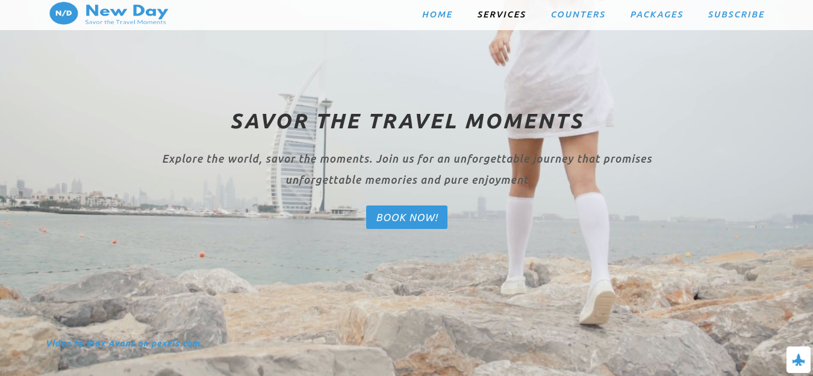
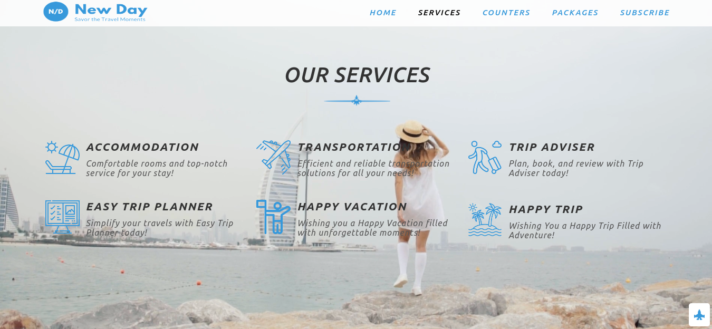
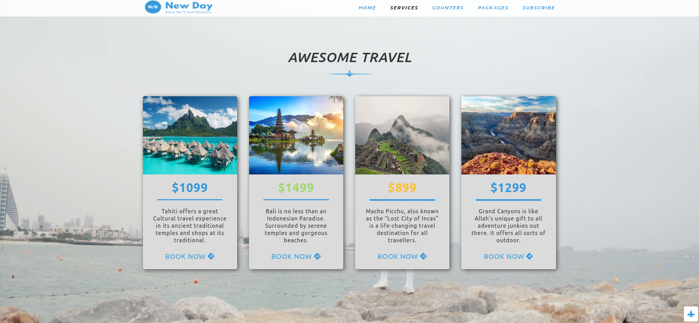
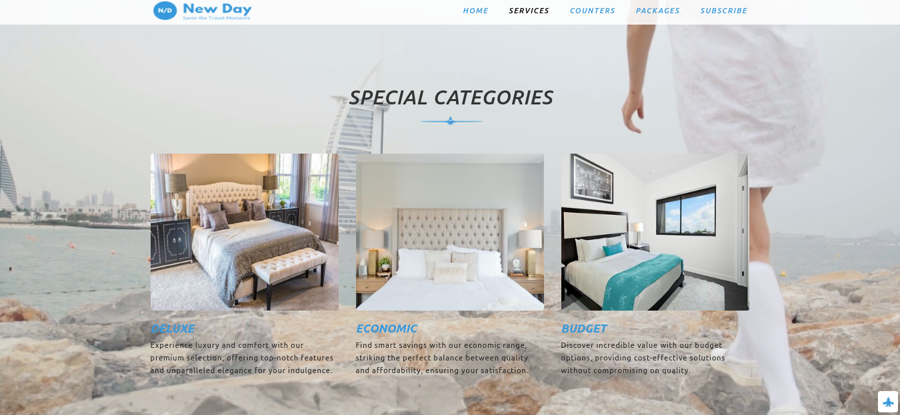
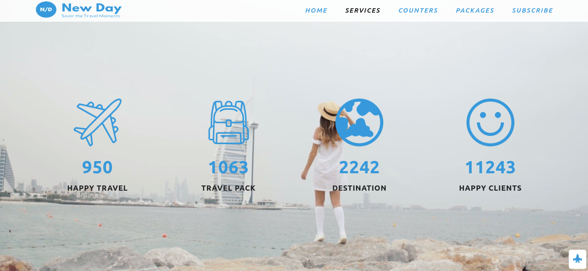

# New Day Travel - Savor The Travel Moment - Learning Project

Welcome to the New Day Travel project, a single-page website designed for educational purposes to practice HTML and CSS.

## Description

This project is a single-page website related to a travel agency. It is not a professional website but rather a learning exercise to implement HTML and CSS skills. Throughout the development of this project, I gained valuable experience in building responsive web designs using media queries. This allowed me to ensure that the website looks and functions well on various screen sizes, from desktop to mobile devices.

## Website URL

You can access the website here: [New Day Travel](https://newdaytravel.netlify.app/)

## Sections

The website consists of several sections, including:

1. [Home](https://newdaytravel.netlify.app/#)
2. [Services](https://newdaytravel.netlify.app/#services)
3. [Counters](https://newdaytravel.netlify.app/#counters)
4. [Packages](https://newdaytravel.netlify.app/#packages)
5. [Subscribe](https://newdaytravel.netlify.app/#subscribe)

## Features

- Responsive design for various screen sizes.
- Different sections related to a travel agency.
- Sample content to practice HTML and CSS.
- A simple, static website for learning purposes.

## Technologies Used

- HTML
- CSS

## Usage

You can visit the website by clicking the link above. Explore the different sections to see the practice content.

## Screenshots

Include some screenshots or images:

## Author

- [Tufan Mulla](https://www.tufanmulla.com/)
- tufanmulla@yahoo.com

## License

MIT License

This project is licensed under the terms of the MIT license. See the [LICENSE](LICENSE) file for details.

## Feedback and Contributions

If you have any feedback or would like to contribute to this learning project, please feel free to open an issue or a pull request.

## Acknowledgments

I would like to acknowledge the following resources, including the "Anisul Islam" YouTube channel, which were instrumental in the development of this project:

- [Anisul Islam's YouTube Channel](https://www.youtube.com/@anisul-islam): Anisul Islam's YouTube channel provided invaluable tutorials and lessons on web development, HTML, CSS, Git, and GitHub. Specific playlists that were particularly helpful include:

  - [HTML Tutorials](https://youtube.com/playlist?list=PLgH5QX0i9K3oHBr5dsumGwjUxByN5Lnw3&si=tvR-kyKSgasdg59N)
  - [CSS Tutorials](https://youtube.com/playlist?list=PLgH5QX0i9K3qjCBXjTmv7Xeh8MDUUVJDO&si=NS4YzG-CQEEXc0S9)
  - [Git and GitHub Tutorials](https://youtube.com/playlist?list=PLgH5QX0i9K3qAW8DT6I0XOxC23qnA4FL-&si=G-y9it1wMTrz2VvR)

These resources, especially Anisul Islam's YouTube channel, played a crucial role in enhancing my understanding of web development and were instrumental in completing this learning project.
